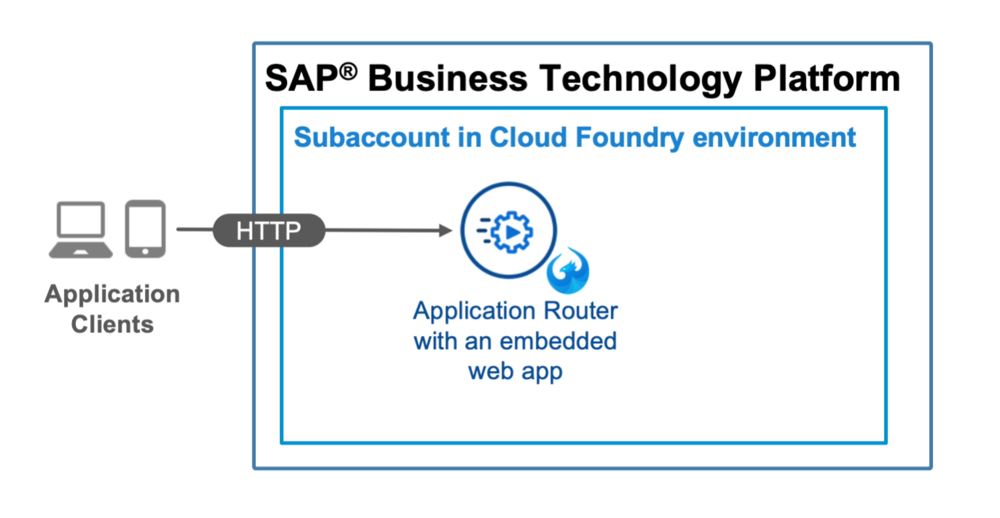

# On Standalone Application Router

## Diagram



## Description

This is an example of an HTML5 app that you maintain on a standalone application router in your own space. The app is directly embedded into your subaccount on the Cloud Foundry environment. That means the static content of the is **not** stored and managed in the HTML5 Application Repository of SAP BTP.


## Download and Installation
1. Download the source code:
    ```
    git clone https://github.com/lambavikas/cap-nodejs.git    
    ```
2. Deploy the application router:
    ```
    npm run approuter-sample1-deploy
    ```

## Configuration
To change path to the default app, edit the `welcomeFile` property in the [`xs-app.json`](router/xs-app.json) configuration file of the app router. You can replace the content of `webapp` to embed another web app in the application router. 

