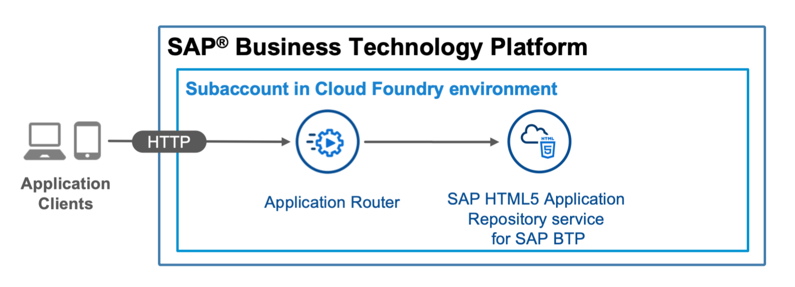
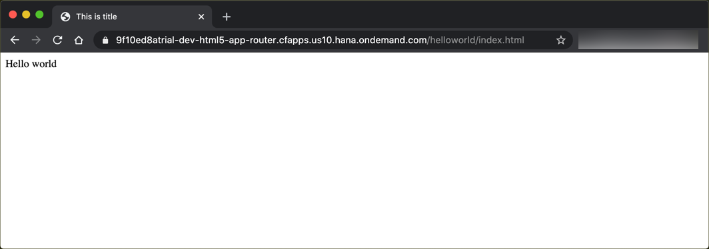

# On Standalone Application Router using HTML5 Application Repository

## Diagram



## Description

This is an example of an HTML5 app that you maintain on a standalone application router in your own space in the Cloud Foundry environment. The app is deployed to the HTML Application Repository.


## Download and Installation
1. Download the source code for project `cap-nodejs`
2. Build the project by staying in the directory `cap-nodejs` on command line
    ```    
    npm install
    npm run build
    ```
3. Deploy the project:
    ```
    npm run approuter-sample2-deploy
    ```

If the deployment has been successful, you find the URL of the application router in the console output

## Configuration
You can replace the content of the `HTML5Module` folder with your own web app. Keep in mind that you also need to change the path to the default app if your web app has a different ID.

To change the path to the default app, edit the `welcomeFile` property in the [`xs-app.json`](router/xs-app.json) configuration file of the application router.

## Check the Result

### List the Deployed HTML5 App

```
$ cf html5-list                                     
Getting list of HTML5 applications in org 9f10ed8atrial / space dev as firstname.lastname@domain.com...
OK

name         version   app-host-id                            service instance   visibility   last changed   
helloworld   1.0.0     1db2ae23-90e9-4055-a22c-6865ca7ad73e   html5_repo_host    public       Mon, 10 Aug 2020 13:26:03 GMT   
```

### List the Deployed MTA

```
$ cf mta approuter_html5
Showing health and status for multi-target app approuter_html5 in org 9f10ed8atrial / space dev as firstname.lastname@domain.com...
OK
Version: 1.0.0

Apps:
name               requested state   instances   memory   disk   urls   
html5_app_router   started           1/1         256M     256M   9f10ed8atrial-dev-html5-app-router.cfapps.us10.hana.ondemand.com   

Services:
name                 service           plan          bound apps         last operation   
html5_repo_host      html5-apps-repo   app-host                         create succeeded   
html5_repo_runtime   html5-apps-repo   app-runtime   html5_app_router   create succeeded   
```

### Check the Web App

Access the URL to view the web app. 

